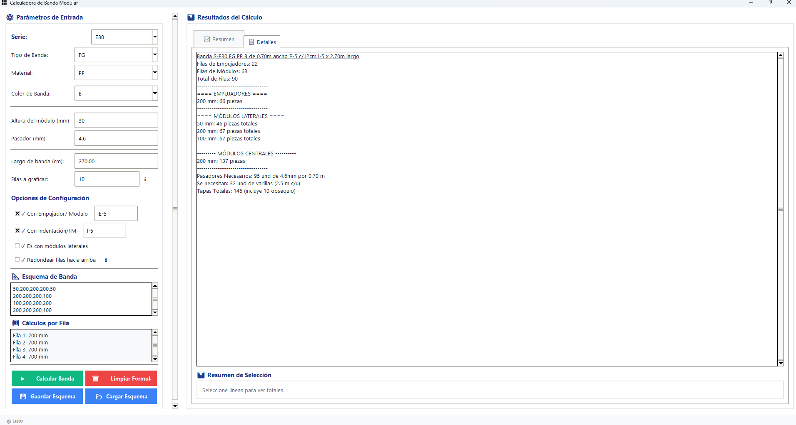
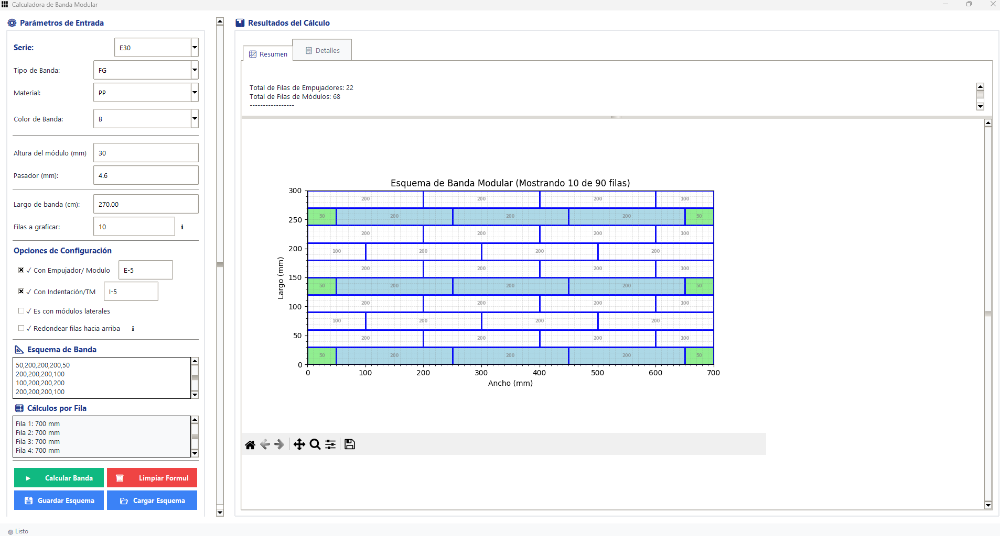
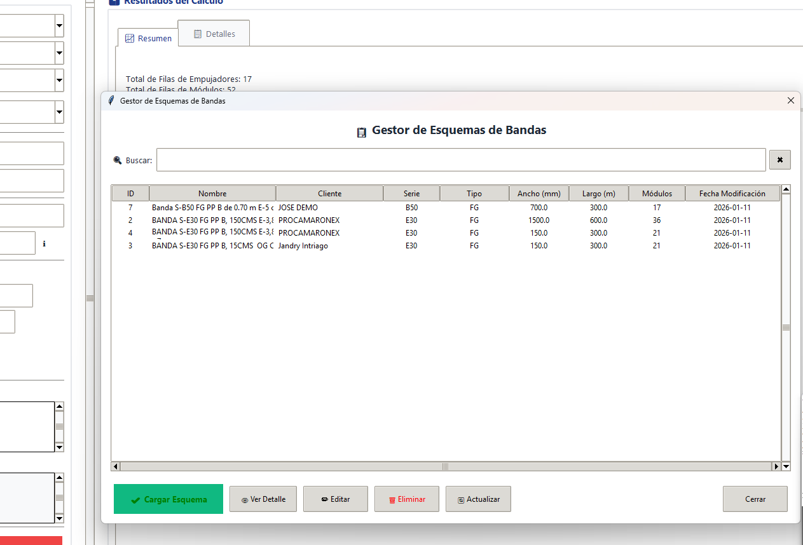

# 🔧 Calculadora de Banda Modular

## 📝 Descripción

La **Calculadora de Banda Modular** es una aplicación de escritorio desarrollada en Python para el diseño, cálculo y visualización de bandas transportadoras modulares. Esta herramienta especializada permite a ingenieros y técnicos configurar diferentes tipos de módulos, realizar cálculos precisos y generar esquemas visuales detallados de las bandas.


## ✨ Características Principales

- **🎨 Interfaz Moderna**: Diseño profesional con tema moderno y colores corporativos
- **📊 Visualización Gráfica**: Generación de esquemas detallados de bandas transportadoras
- **⚙️ Configuración Flexible**: Múltiples opciones de series, tipos, materiales y colores
- **💾 Gestión de Esquemas**: Guardado y carga de configuraciones personalizadas
- **📋 Análisis Detallado**: Cálculos automáticos de módulos y empujadores
- **🔧 Exportación**: Generación de reportes y diagramas exportables
- **🗄️ Base de Datos**: Sistema de almacenamiento local SQLite

## 🏗️ Estructura del Proyecto

```
Calculadora_Banda_Modular/
├── 📁 assets/                    # Recursos estáticos
├── 📁 controllers/               # Lógica de control
│   ├── clipboard.py             # Gestión del portapapeles
│   ├── generator.py             # Generación de esquemas
│   └── utils.py                 # Utilidades generales
├── 📁 models/                   # Modelos de datos
│   ├── database.py              # Gestión de base de datos
│   └── series.py                # Modelos de series
├── 📁 views/                    # Interfaz de usuario
│   ├── main_window.py           # Ventana principal
│   ├── loading_view.py          # Pantalla de carga
│   ├── save_schema_dialog.py    # Diálogo para guardar
│   └── schema_manager.py        # Gestor de esquemas
├── main.py                      # Punto de entrada
├── requirements.txt             # Dependencias
└── build_launcher.py           # Constructor de ejecutable
```

## 🔧 Tecnologías Utilizadas

- **Python 3.8+**: Lenguaje principal
- **Tkinter**: Interfaz gráfica de usuario
- **Matplotlib**: Generación de gráficos y visualizaciones
- **Pandas**: Manipulación y análisis de datos
- **NumPy**: Cálculos matemáticos
- **SQLite3**: Base de datos local
- **Pillow**: Procesamiento de imágenes
- **PyInstaller**: Creación de ejecutables

## 📦 Instalación

### Prerrequisitos

- Python 3.8 o superior
- pip (gestor de paquetes de Python)

### Instalación desde código fuente

1. **Clonar el repositorio**
   ```bash
   git clone https://github.com/jose29di/ModularBeltCalc.git
   cd ModularBeltCalc
   ```

2. **Instalar dependencias**
   ```bash
   pip install -r requirements.txt
   ```

3. **Ejecutar la aplicación**
   ```bash
   python main.py
   ```

### Instalación como ejecutable

1. **Construir el ejecutable**
   ```bash
   python build_launcher.py
   ```

2. **Ejecutar el archivo .exe generado**
   - El ejecutable se creará en la carpeta `dist/`

## 🚀 Uso

### Inicio Rápido

1. **Ejecutar la aplicación**
   ```bash
   python main.py
   ```

2. **Configurar parámetros**
   - Seleccionar serie de banda
   - Elegir tipo de banda
   - Especificar material y color
   - Configurar dimensiones

3. **Diseñar esquema**
   - Ingresar configuración de módulos
   - Activar opciones deseadas (empujadores, desglose, etc.)
   - Generar visualización

4. **Exportar resultados**
   - Guardar esquema en base de datos
   - Exportar diagramas e informes

### Características Avanzadas

- **Gestión de esquemas guardados**: Acceso rápido a configuraciones anteriores
- **Cálculos automáticos**: Determinación automática de módulos necesarios
- **Visualización interactiva**: Zoom y navegación en los diagramas generados
- **Exportación flexible**: Múltiples formatos de salida

## 📊 Funcionalidades Principales

### 🎯 Módulos de Cálculo

- **Procesamiento de arreglos**: Conversión de configuraciones de texto a esquemas
- **Cálculos de dimensiones**: Determinación automática de medidas
- **Análisis de componentes**: Conteo y clasificación de elementos

### 📈 Visualización

- **Diagramas 2D**: Representación gráfica detallada de las bandas
- **Código de colores**: Diferenciación visual por tipos y materiales
- **Escalado automático**: Ajuste dinámico según las dimensiones

### 💾 Persistencia

- **Base de datos local**: Almacenamiento de configuraciones
- **Esquemas personalizados**: Guardado de diseños específicos
- **Historial de proyectos**: Acceso a trabajos anteriores

## 🛠️ Desarrollo

### Configuración del entorno de desarrollo

1. **Clonar repositorio**
   ```bash
   git clone https://github.com/jose29di/ModularBeltCalc.git
   cd ModularBeltCalc
   ```

2. **Crear entorno virtual**
   ```bash
   python -m venv venv
   venv\Scripts\activate  # Windows
   # source venv/bin/activate  # Linux/Mac
   ```

3. **Instalar dependencias de desarrollo**
   ```bash
   pip install -r requirements.txt
   ```

### Arquitectura del Código

- **Patrón MVC**: Separación clara entre modelos, vistas y controladores
- **Modularidad**: Componentes independientes y reutilizables
- **Gestión de estado**: Manejo centralizado de datos y configuraciones

## 📋 Dependencias

### Principales
- `matplotlib>=3.5.0` - Visualización y gráficos
- `pandas>=1.4.0` - Manipulación de datos
- `numpy>=1.21.0` - Cálculos matemáticos
- `Pillow>=9.0.0` - Procesamiento de imágenes
- `openpyxl>=3.0.0` - Lectura de archivos Excel

### Desarrollo y construcción
- `pyinstaller>=5.0.0` - Generación de ejecutables

## 🤝 Contribución

Las contribuciones son bienvenidas. Para contribuir:

1. **Fork** el repositorio
2. **Crear** una rama para tu feature (`git checkout -b feature/AmazingFeature`)
3. **Commit** tus cambios (`git commit -m 'Add some AmazingFeature'`)
4. **Push** a la rama (`git push origin feature/AmazingFeature`)
5. **Abrir** un Pull Request

## 📝 Licencia

Este proyecto está bajo la Licencia MIT. Ver el archivo `LICENSE` para más detalles.

## 👥 Autores

- **Jose Mejia** - [@jose29di](https://github.com/jose29di)

## 📞 Contacto

Para preguntas o soporte:
- GitHub Issues: [ModularBeltCalc Issues](https://github.com/jose29di/ModularBeltCalc/issues)
- Email: Disponible a través del perfil de GitHub

## 🔄 Historial de Versiones

### [Actual] - 2026-01-11
- ✅ Interfaz gráfica moderna con tema profesional
- ✅ Sistema de base de datos SQLite
- ✅ Generación de esquemas visuales
- ✅ Gestión de configuraciones personalizadas
- ✅ Soporte para múltiples series y tipos de banda

---

## 📸 Capturas de Pantalla

### Interfaz Principal


### Diagrama de Banda


### Gestor de Esquemas


⭐ **¡Si te resulta útil este proyecto, no olvides darle una estrella!** ⭐